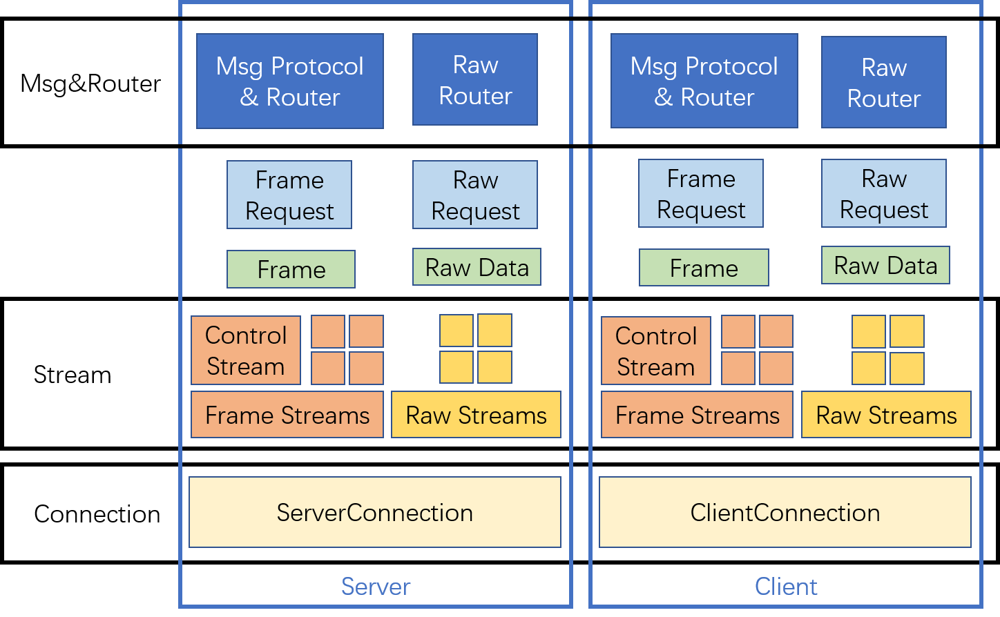

The structure of the Dollop

features:
1. One connection can create many streams.
2. There are two kinds of stream: Raw Stream and Frame Stream.
3. Binding DIY Msg Protocol and corresponding Msg level Router to a Frame Stream.

etc.

---
dev references:
- https://github1s.com/quic-go/quic-go/blob/HEAD/server.go#L122-L123
- https://github1s.com/yomorun/yomo/blob/HEAD/core/server.go#L444
- https://zhuanlan.zhihu.com/p/338688506
- https://www.jianshu.com/p/4cf92c5a386d